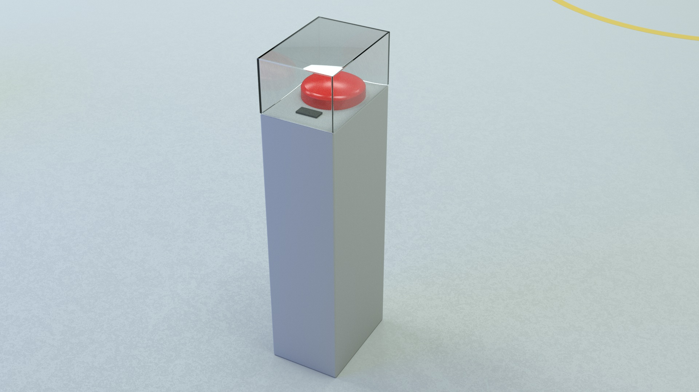
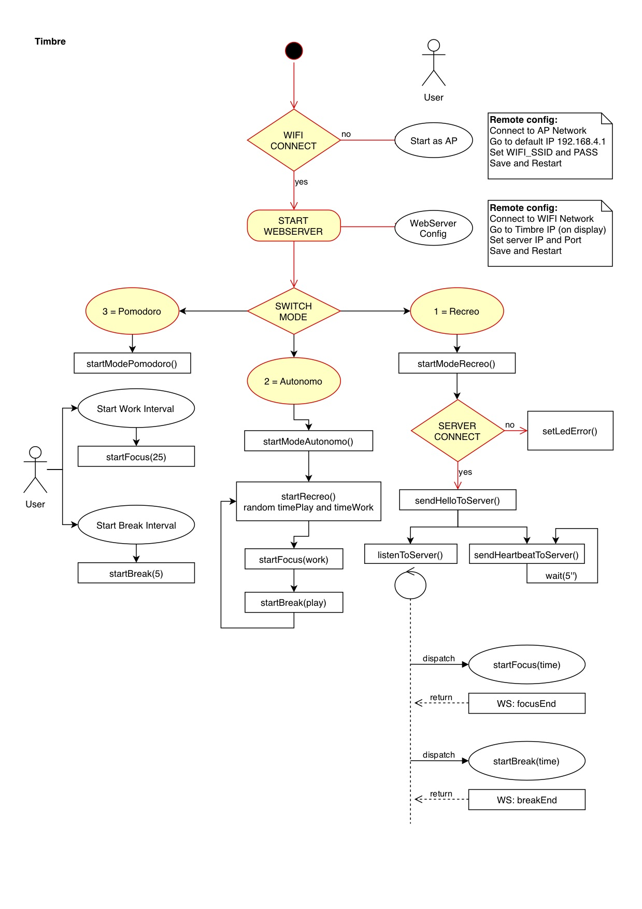

# Timbre



**Objeto sonoro interactivo. Timbre de escuela, arduino.**

Es el encargado de comunicar el comienzo y fin del recreo. Divide la temporalidad en dos estados: **“PLAY** y **“CODE"**. Está compuesto por un timbre de colegio que suena al cambiar de estado y un display digital que imprime mensajes y tiempo restante. La duración del estado varía según las **Reglas del recreo** en curso que son consumidas mediante un servicio API. De no poder establecer comunicación, el dispositivo puede configurarse para funcionar en modo Autónomo (duraciones aleatorias) o Pomodoro (controlado vía App). Los comportamientos de los dispositivos que componen la instalación están condicionados según estos dos estados.

---

## Indice

- [Instrucciones](#instrucciones)
  - [Configurar AP](#configurar-ap)
  - [Configurar WebSockets](#configurar-websockets)
  - [Testing](#testing)
- [API](#api)
- [Flujo de trabajo](#flujo-de-trabajo)
- [Circuito](#circuito)
- [Hardware](#hardware)
- [Código](#código)
  - [Drivers](#drivers)
  - [Librerías](#librerías)
  - [Ejemplos](#ejemplos)
- [Enlaces útiles](#enlaces-útiles)

---

## Instrucciones

Como montar el dispositivo.

1. Revisar que el **Router** y las **Reglas del recreo** se encuentren encendidas
2. Enchufar dispositivo y esperar a que encienda el LED
3. Revisar color del LED
   - **Verde:** Funcionando.
   - **Azul:** Problema: No se pudo conectar a **Reglas de recreo**, revisar [Configuración](#configuración).
   - **Rojo:** Error: Si en pantalla imprime un IP, ingresa desde una

### Configuración

#### Configurar AP

- When your ESP starts up, it sets it up in Station mode and tries to connect to a previously saved Access Point
- If this is unsuccessful (or no previous network saved) it moves the ESP into Access Point mode and spins up a DNS and WebServer **(default ip 192.168.4.1)**
- Using any wifi enabled device with a browser (computer, phone, tablet) connect to the newly created Access Point
- Because of the Captive Portal and the DNS server, you will either get a 'Join to network' type of popup or get any domain you try to access redirected to the configuration portal
- Choose one of the access points scanned, enter a password, click save
- ESP will try to connect. If successful, it relinquishes control back to your app. If not, reconnect to AP and reconfigure.

```
// Wifi
const char* wifi_ssid = "quale-privada";
const char* wifi_password = "quale2010pri";

// Server
const char* io_server = "192.168.1.107";
uint64_t io_server_port = 3000;
```

When your ESP starts up, it sets it up in Station mode and tries to connect to a previously saved Access Point
If this is unsuccessful (or no previous network saved) it moves the ESP into Access Point mode and spins up a DNS and WebServer (default ip 192.168.4.1)
Using any wifi enabled device with a browser (computer, phone, tablet) connect to the newly created Access Point
Because of the Captive Portal and the DNS server, you will either get a 'Join to network' type of popup or get any domain you try to access redirected to the configuration portal
Choose one of the access points scanned, enter a password, click save
ESP will try to connect. If successful, it relinquishes control back to your app. If not, reconnect to AP and reconfigure.

#### Configurar WebSockets

#### Testing

- Ruta "/": Index
- Ruta "/testing": Probar funcionalidades
- Ruta "/pomodoro": Configurar Pomodoro

## API

Endpoints consumidos por el dispositivo:

| Endpoint            | Verb | Description                                        |
| ------------------- | ---- | -------------------------------------------------- |
| `/v1/recreo`        | GET  | If set to true, the result will also include cats. |
| `/v1/recreo/estado` | GET  | If set to true, the result will also include cats. |
| `/v1/recreo/estado` | PUT  | If set to true, the result will also include cats. |

**[Documentación API](https://colormono.com/recreo/api/reference/)**

## Flujo de trabajo



## Circuito


## Hardware

Lista de componentes utilizados

- NodeMCU 1.0 (ESP-12E Module)
- Modulo Display 4 digitos Catalex
- Modulo 1 Relay
- Modulo 1 Led RGB
- Timbre 220v
- Fuente de alimentación para protoboard 5v, 3.3v
- Fuente de alimentación 5v 2amp

## Código

Para poder compilar el código y subirlo al microcontrolador es requerido que estén instalados los drivers y las librerías listadas a continuación.

### Drivers

- [CP210x USB to UART Bridge VCP Drivers](https://www.silabs.com/products/development-tools/software/usb-to-uart-bridge-vcp-drivers) - Driver para dispositivos chinos
- [Driver CH340 MacOS](https://www.geekfactory.mx/download/driver-ch340-macos/) - Driver alternativo para dispositivos chinos

### Librerías

Las versiones de las librerías utilizadas al momento de desarrollo del proyecto se encuentran en el directorio `/libraries`.

- [Arduino ESP8266](https://github.com/esp8266/Arduino) - Soporte para ESP8266 (Instrucciones de instalación en el link)
- [Arduino WebSockets](https://github.com/Links2004/arduinoWebSockets) - Soporte para WebSockets. Usar la versión 5.\*. Prestar especial atención porque Arduino instala por defecto la 6.
- [Arduino JSON](https://arduinojson.org/) - Soporte documentos JSON
- [Arduino SevenSegmentTM1637](https://github.com/bremme/arduino-tm1637) - Soporte Display de 7 segmentos
- [Arduino WiFiManager](https://github.com/tzapu/WiFiManager) - Plugin para conectarse remotamente (IP por defecto: 192.168.4.1)
- [Arduino ESP8266 filesystem uploader](https://github.com/esp8266/arduino-esp8266fs-plugin) - Plugin para subir archivos a la memoria del ESP8266

### Ejemplos

En el directorio `/examples` se encuentran sketchs con posibles soluciones a los ditstintos problemas, atacándolos por separado.

## Enlaces útiles

- [Nodemcu dev kit using Arduino IDE: Get started with ESP8266](https://www.amazon.com/Nodemcu-dev-kit-using-Arduino-ebook/dp/B01A1R31K2/) - Libro de referencia
- [Quick start to Nodemcu ESP8266](http://www.instructables.com/id/Quick-Start-to-Nodemcu-ESP8266-on-Arduino-IDE/) - Como instalar los drivers en la IDE de Arduino y controlar un LED desde el navegador.
- [ESP8266 Web Client: Accessing API's Using Arduino IDE](https://www.youtube.com/watch?v=8xqgdXvn3yw) - Video tutorial
- [SEVEN PRO TIPS FOR ESP8266](https://www.instructables.com/id/ESP8266-Pro-Tips/) - Tips para el ESP8266
- [Circuits4Yiou](https://circuits4you.com/) - Tutoriales para ESP8266
- [Control del tiempo en NODE](https://nodejs.org/en/docs/guides/timers-in-node/) - Tutorial para manejar "múltiples threads"
- [Using millis() Instead of delay()](https://www.norwegiancreations.com/2017/09/arduino-tutorial-using-millis-instead-of-delay/) - Tutorial para manejar "múltiples threads"
- [Arduino Time](http://playground.arduino.cc/Code/Time) - Librería con funciones para el control de tiempo
- [Build an ESP8266 Web Server – Code and Schematics](https://randomnerdtutorials.com/esp8266-web-server/) - Tutorial WebServer
- [Example of ESP8266 Flash File System (SPIFFS)](https://circuits4you.com/2018/01/31/example-of-esp8266-flash-file-system-spiffs/) - Almacenar en la memoria flash archivos (configuración y contenidos)
- [ESP8266 – SPIFFS + JSON](http://www.sinaptec.alomar.com.ar/2017/06/tutorial-8-esp8266-spiffs-json.html) - Tutorial SPIFFS y JSON
- [NodeMCU RGB LED on Arduino IDE](https://roboindia.com/tutorials/RGB-LED-nodemcu) - Tutorial LED RGB
- [ESP8266 Ajax Update without refreshing](https://circuits4you.com/2018/02/04/esp8266-ajax-update-part-of-web-page-without-refreshing/)
- [ESP8266 Json parsing example](https://circuits4you.com/2019/01/11/nodemcu-esp8266-arduino-json-parsing-example/)
- [ESP8266 data logging with real time graphs](https://circuits4you.com/2019/01/11/esp8266-data-logging-with-real-time-graphs/)
- [Arduino Library](https://www.arduino.cc/en/Hacking/LibraryTutorial)
